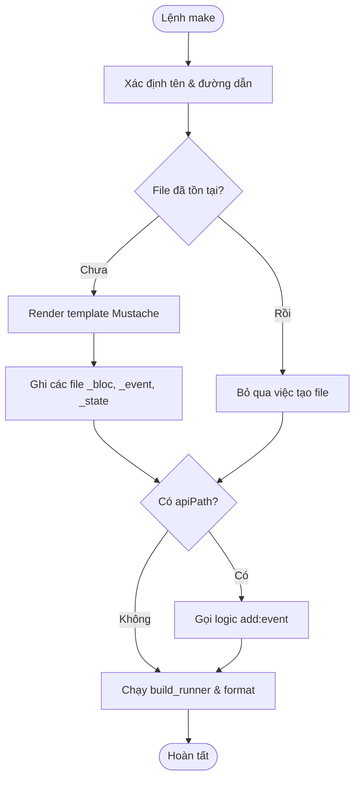
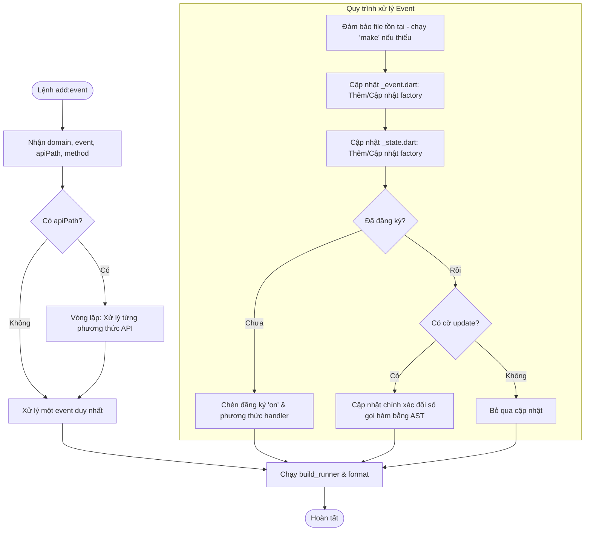

# blocz

Một công cụ dòng lệnh (CLI) giúp tăng tốc độ phát triển ứng dụng Flutter bằng cách tự động tạo các thành phần cho BLoC pattern.

[](https://pub.dev/packages/blocz)

## Giới thiệu

`blocz` giúp bạn tạo nhanh chóng các tệp BLoC, Event, và State theo một cấu trúc thư mục được định sẵn, giúp bạn tiết kiệm thời gian và giữ cho code base của bạn nhất quán. Công cụ này cũng hỗ trợ thêm các event vào một BLoC đã có.

## Tính năng

- Tạo BLoC, Event, và State chỉ với một lệnh duy nhất.
- Tự động tạo cấu trúc thư mục theo domain.
- Mã nguồn được tạo ra tương thích với các package phổ biến như `flutter_bloc`, `freezed`, và `injectable`.
- Hỗ trợ thêm nhanh các event vào BLoC.
- Tự động nhập (import) các event và trình xử lý từ tệp tin service API.
- **Cập nhật Thông minh & Chính xác**: Sử dụng Dart AST (Abstract Syntax Tree) để phân tích và cập nhật mã nguồn một cách chính xác, bảo toàn các thay đổi thủ công của bạn.

## Cách thức hoạt động

### 1. Khởi tạo BLoC (`make`)

Lệnh `make` tạo cấu trúc BLoC ban đầu.



### 2. Thêm Event (`add:event`)

Lệnh `add:event` thêm hoặc cập nhật các event trong BLoC hiện có.



> [!NOTE]
> `blocz` sử dụng package `analyzer` của Dart để chuyển đổi code của bạn thành một **Cây Cú pháp Trừu tượng (AST - Abstract Syntax Tree)**. Điều này cho phép công cụ thực hiện các cập nhật cực kỳ chính xác—chỉ thay thế những phần cần thiết (như các đối số của phương thức) trong khi vẫn giữ nguyên logic tùy chỉnh khác của bạn.

## Điều kiện tiên quyết

Chạy các lệnh sau trong thư mục dự án Flutter của bạn để thêm các dependency cần thiết:

```bash
flutter pub add flutter_bloc freezed_annotation injectable get_it
flutter pub add --dev build_runner freezed injectable_generator
```

## Cài đặt

Cài đặt `blocz` như một công cụ global để có thể sử dụng ở bất kỳ đâu:

```bash
dart pub global activate blocz
```

## Hướng dẫn sử dụng

### 1. Tạo BLoC, Event, và State

Sử dụng lệnh `make` để tạo các thành phần cần thiết.

```bash
blocz make --domain <ten_domain> --name <ten_bloc> [--apiPath <duong_dan_file_api>] [--writeDir <duong_dan_tuy_chinh>]
```

- `--domain` (hoặc `-d`): Domain hoặc feature của BLoC (ví dụ: `pet`, `product`).
- `--name` (hoặc `-n`)(optional): Tên của BLoC, hoặc tên sub-domain/sub-feature (ví dụ: `authentication`, `profile`).
- `--apiPath` (hoặc `-a`)(optional): Đường dẫn tùy chọn đến tệp tin service API. Nếu được cung cấp, `blocz` sẽ tự động tạo và triển khai các event cho tất cả các phương thức public trong tệp đó.
- `--writeDir` (hoặc `-w`)(optional): Đường dẫn tùy chỉnh để tạo các tệp. Mặc định là `lib/features/<domain>/presentation/bloc`.

#### Hỗ trợ Template cho `writeDir`

Bạn có thể sử dụng các biến template trong đường dẫn `--writeDir`:

- `{{DOMAIN}}` hoặc `{{domain}}`: Được thay thế bằng tên domain định dạng snake_case.
- `{{Domain}}`: Được thay thế bằng tên domain định dạng PascalCase.

**Ví dụ:**

```bash
blocz make --domain pet --writeDir "lib/App/screens/{{DOMAIN}}_page/bloc"
```

**Ví dụ:**

Tạo BLoC cơ bản:

```bash
blocz make --domain pet
```

> Cây thư mục tệp được tạo

```
lib/features/pet/presentation/bloc/
├── pet_bloc.dart
├── pet_event.dart
└── pet_state.dart
```

Lệnh này tạo ra cấu trúc BLoC. Sau đó bạn sẽ cần chạy `build_runner`.

Tạo BLoC và tự động thêm event từ file API:

#### Ví dụ với OpenAPI generator:

```bash
export MY_PET_API_PACKAGE_NAME="my_pet_api"
export MY_PET_API_DIR="./apis/$MY_PET_API_PACKAGE_NAME"
rm -fr $MY_PET_API_DIR || true # xóa thư mục cũ
mkdir -p $MY_PET_API_DIR # tạo thư mục nếu chưa có
npx @openapitools/openapi-generator-cli generate
  -i https://petstore.swagger.io/v2/swagger.json
  -g dart
  --additional-properties=pubName=$MY_PET_API_PACKAGE_NAME
  -o $MY_PET_API_DIR
cd $MY_PET_API_DIR
  && dart pub get
  && (dart run build_runner build || true)
  && cd "$(git rev-parse --show-toplevel)"
ls -lh "./apis/$MY_PET_API_PACKAGE_NAME/lib/api/"
```

```yaml
# trong file pubspec.yaml của bạn
dependencies:
  my_pet_api: # Thêm gói API cục bộ
    path: ./apis/my_pet_api
```

```bash
blocz make --domain pet --apiPath ./apis/my_pet_api/lib/api/pet_api.dart
```

Lệnh này sẽ tạo các tệp BLoC và cũng tự động thêm các event và trình xử lý cho tất cả các phương thức được tìm thấy trong `pet_api.dart`.

```dart
// $PROJECT/lib/features/pet/presentation/bloc/pet_event.dart
part of 'pet_bloc.dart';

@freezed
sealed class PetEvent with _$PetEvent {
  const factory PetEvent.loading() = _PetEventLoading;
  const factory PetEvent.addPet(Pet body) = _AddPetRequested;
  const factory PetEvent.deletePet(int petId, {String? apiKey}) = _DeletePetRequested;
  const factory PetEvent.findPetsByStatus(List<String> status) = _FindPetsByStatusRequested;
  const factory PetEvent.findPetsByTags(List<String> tags) = _FindPetsByTagsRequested;
  const factory PetEvent.getPetById(int petId) = _GetPetByIdRequested;
  const factory PetEvent.updatePet(Pet body) = _UpdatePetRequested;
  const factory PetEvent.updatePetWithForm(int petId, {String? name, String? status}) = _UpdatePetWithFormRequested;
  const factory PetEvent.uploadFile(int petId, {String? additionalMetadata, MultipartFile? file}) = _UploadFileRequested;
}

```

```dart
// $PROJECT/lib/features/pet/presentation/bloc/pet_state.dart
part of 'pet_bloc.dart';

@freezed
sealed class PetState with _$PetState {
  const factory PetState.initial() = _InitialDone;
  const factory PetState.loading() = _Loading;
  const factory PetState.failure(String message) = _Failure;
  const factory PetState.addPetResult() = _AddPetResult;
  const factory PetState.deletePetResult() = _DeletePetResult;
  const factory PetState.findPetsByStatusResult(List<Pet>? data) = _FindPetsByStatusResult;
  const factory PetState.findPetsByTagsResult(List<Pet>? data) = _FindPetsByTagsResult;
  const factory PetState.getPetByIdResult(Pet? data) = _GetPetByIdResult;
  const factory PetState.updatePetResult() = _UpdatePetResult;
  const factory PetState.updatePetWithFormResult() = _UpdatePetWithFormResult;
  const factory PetState.uploadFileResult(ApiResponse? data) = _UploadFileResult;
}

```

**Quan trọng:** Sau khi tạo các tệp, vì chúng sử dụng `freezed`, bạn cần chạy `build_runner` để tạo các tệp `.freezed.dart` và `.g.dart`:

```bash
dart run build_runner build --delete-conflicting-outputs
```

### 2. Thêm một Event

Sử dụng lệnh `add:event` để thêm một event mới vào một BLoC đã tồn tại.

```bash
blocz add:event --domain <ten_domain> --name <ten_sub_domain> <options>
```

**Tùy chọn:**

- `--name <ten_sub_domain>` (hoặc `-n`): Tên của BLoC hoặc sub-domain (ví dụ: `profile`).
- `--event <ten_event>`: Thêm một event cụ thể.
- `--apiPath <duong_dan_file_api>`: Quét tệp API và tạo các event và trình xử lý cho **tất cả** các phương thức public.
- `--apiPath <duong_dan_file_api> --method <ten_phuong_thuc>`: Tạo một event và trình xử lý cho **chỉ một** phương thức được chỉ định từ tệp API.
- `--writeDir <duong_dan_tuy_chinh>` (hoặc `-w`): Đường dẫn tùy chỉnh nơi chứa các tệp BLoC.

**Ví dụ:**

Thêm một event đơn giản:

```bash
blocz add:event --domain pet --name login --event LogoutButtonPressed
```

Thêm tất cả các event từ một tệp API:

```bash
blocz add:event --domain pet --name profile --apiPath ./packages/my_pet_api/lib/api/pet_api.dart
```

Thêm một event từ một phương thức API cụ thể:

```bash
blocz add:event --domain pet --name profile --event UpdateAvatar --apiPath lib/features/pet/data/api/pet_api.dart --method uploadAvatar
```

Lệnh này sẽ cập nhật các tệp BLoC tương ứng để thêm (các) event mới.

## Các lệnh khác

`blocz` cũng cung cấp nhiều lệnh phụ trợ để phân tích mã nguồn Dart. Sử dụng `blocz --help` để xem tất cả các lệnh có sẵn.
