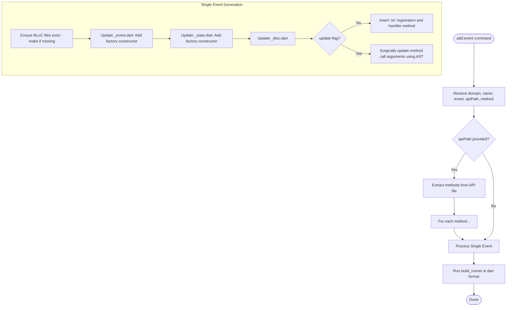

# blocz

A command-line interface (CLI) tool to speed up Flutter app development by scaffolding BLoC pattern components.

[](https://pub.dev/packages/blocz)

## About

`blocz` helps you quickly generate BLoC, Event, and State files in a structured directory, saving you time and keeping your codebase consistent. The tool also supports adding events to an existing BLoC.

## Features

- Generate BLoC, Event, and State with a single command.
- Automatically create a domain-based directory structure.
- The generated code is compatible with popular packages like `flutter_bloc`, `freezed`, and `injectable`.
- Supports quickly adding new events to a BLoC.
- Automatically import events and handlers from an API service file.

## How it Works

The following diagram illustrates the flow of adding a new event (or multiple events from an API) using `blocz add:event`:



## Prerequisites

Run these commands in your Flutter project directory to add the required dependencies:

```bash
flutter pub add flutter_bloc freezed_annotation injectable get_it
flutter pub add --dev build_runner freezed injectable_generator
```

## Installation

Activate `blocz` as a global tool to use it from anywhere:

```bash
dart pub global activate blocz
```

## Usage

### 1. Create BLoC, Event, and State

Use the `make` command to generate the necessary components.

```bash
blocz make --domain <domain_name> --name <bloc_name> [--apiPath <path_to_api_file>] [--writeDir <custom_path>]
```

- `--domain` (or `-d`): The domain or feature of the BLoC (e.g., `pet`, `product`).
- `--name` (or `-n`)(optional): The name of the BLoC, or a sub-domain/sub-feature name (e.g., `authentication`, `profile`).
- `--apiPath` (or `-a`)(optional): Optional path to an API service file. If provided, `blocz` will automatically generate and implement events for all public methods in that file.
- `--writeDir` (or `-w`)(optional): Custom directory to generate files. Defaults to `lib/features/<domain>/presentation/bloc`.

#### `writeDir` Template Support

You can use template variables in the `--writeDir` path:

- `{{DOMAIN}}` or `{{domain}}`: Replaced by the domain name in snake_case.
- `{{Domain}}`: Replaced by the domain name in PascalCase.

**Example:**

```bash
blocz make --domain pet --writeDir "lib/App/screens/{{DOMAIN}}_page/bloc"
```

**Examples:**

Basic BLoC creation:

```bash
blocz make --domain pet
```

> Generated files tree

```
lib/features/pet/presentation/bloc/
├── pet_bloc.dart
├── pet_event.dart
└── pet_state.dart
```

This command creates the BLoC structure. You will then need to run `build_runner`.

BLoC creation with automatic event implementation from an API file:

#### Example with OpenAPI generator:

```bash
export MY_PET_API_PACKAGE_NAME="my_pet_api"
export MY_PET_API_DIR="./apis/$MY_PET_API_PACKAGE_NAME"
rm -fr $MY_PET_API_DIR || true # remove old
mkdir -p $MY_PET_API_DIR # create if not exists
npx @openapitools/openapi-generator-cli generate
  -i https://petstore.swagger.io/v2/swagger.json
  -g dart
  --additional-properties=pubName=$MY_PET_API_PACKAGE_NAME
  -o $MY_PET_API_DIR
cd $MY_PET_API_DIR
  && dart pub get
  && (dart run build_runner build || true)
  && cd "$(git rev-parse --show-toplevel)"
ls -lh "./apis/$MY_PET_API_PACKAGE_NAME/lib/api/"
```

```yaml
# in your pubspec.yaml
dependencies:
  my_pet_api: # Added local API package
    path: ./apis/my_pet_api
```

```bash
blocz make --domain pet --apiPath ./apis/my_pet_api/lib/api/pet_api.dart
```

This command will create the BLoC files and also automatically add events and handlers for all methods found in `pet_api.dart`.

```dart
// $PROJECT/lib/features/pet/presentation/bloc/pet_event.dart
part of 'pet_bloc.dart';

@freezed
sealed class PetEvent with _$PetEvent {
  const factory PetEvent.loading() = _PetEventLoading;
  const factory PetEvent.addPet(Pet body) = _AddPetRequested;
  const factory PetEvent.deletePet(int petId, {String? apiKey}) = _DeletePetRequested;
  const factory PetEvent.findPetsByStatus(List<String> status) = _FindPetsByStatusRequested;
  const factory PetEvent.findPetsByTags(List<String> tags) = _FindPetsByTagsRequested;
  const factory PetEvent.getPetById(int petId) = _GetPetByIdRequested;
  const factory PetEvent.updatePet(Pet body) = _UpdatePetRequested;
  const factory PetEvent.updatePetWithForm(int petId, {String? name, String? status}) = _UpdatePetWithFormRequested;
  const factory PetEvent.uploadFile(int petId, {String? additionalMetadata, MultipartFile? file}) = _UploadFileRequested;
}

```

```dart
// $PROJECT/lib/features/pet/presentation/bloc/pet_state.dart
part of 'pet_bloc.dart';

@freezed
sealed class PetState with _$PetState {
  const factory PetState.initial() = _InitialDone;
  const factory PetState.loading() = _Loading;
  const factory PetState.failure(String message) = _Failure;
  const factory PetState.addPetResult() = _AddPetResult;
  const factory PetState.deletePetResult() = _DeletePetResult;
  const factory PetState.findPetsByStatusResult(List<Pet>? data) = _FindPetsByStatusResult;
  const factory PetState.findPetsByTagsResult(List<Pet>? data) = _FindPetsByTagsResult;
  const factory PetState.getPetByIdResult(Pet? data) = _GetPetByIdResult;
  const factory PetState.updatePetResult() = _UpdatePetResult;
  const factory PetState.updatePetWithFormResult() = _UpdatePetWithFormResult;
  const factory PetState.uploadFileResult(ApiResponse? data) = _UploadFileResult;
}

```

**Important:** Since the generated files use `freezed`, you need to run `build_runner` after generation:

```bash
dart run build_runner build --delete-conflicting-outputs
```

### 2. Add an Event

Use the `add:event` command to add a new event to an existing BLoC.

```bash
blocz add:event --domain <domain_name> --name <sub_domain_name> <options>
```

**Options:**

- `--name <sub_domain_name>` (or `-n`): The name of the BLoC or sub-domain (e.g., `profile`).
- `--event <event_name>`: Adds a single, specified event.
- `--apiPath <path_to_api_file>`: Scans the API file and generates events and handlers for **all** public methods.
- `--apiPath <path_to_api_file> --method <method_name>`: Generates an event and handler for **only one** specified method from the API file.
- `--writeDir <custom_path>` (or `-w`): Custom directory where the BLoC files are located.

**Examples:**

Add a simple event:

```bash
blocz add:event --domain pet --event bark
```

Add all events from an API file:

```bash
blocz add:event --domain pet --apiPath ./apis/my_pet_api/lib/api/pet_api.dart
```

Add a single event from a specific API method:

```bash
blocz add:event --domain pet --name profile --event UpdateAvatar --apiPath ./apis/my_pet_api/lib/api/pet_api.dart --method uploadFile
```

This command will update the corresponding BLoC files to add the new event(s).

## Other Commands

`blocz` also provides many helper commands for parsing Dart source code. Use `blocz --help` to see all available commands.
