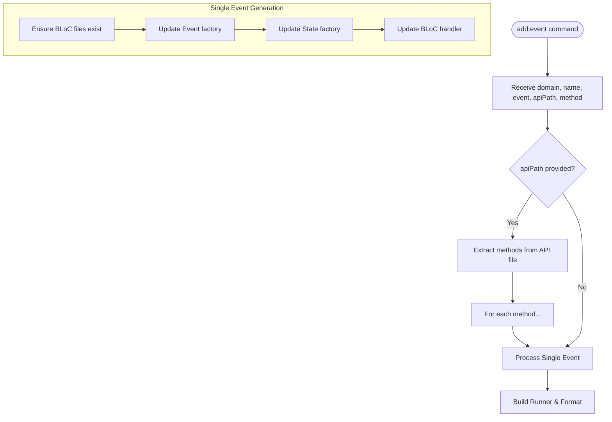

# Blocz Example

This is a simple example showing how to use `blocz` to generate BLoC components from an API service.

## Setup

First, make sure you have `blocz` installed:

```bash
dart pub global activate --source path ..
```

## Running Blocz

To generate a BLoC for the `User` domain using the `ExampleApi`:

```bash
blocz make --domain user --apiPath lib/api/example_api.dart
```

This project demonstrates how `blocz` can be used to scaffold a feature with BLoC, events, and states, and how it can automatically integrate with an API layer.

This will create:

- `lib/features/user/presentation/bloc/user_bloc.dart`
- `lib/features/user/presentation/bloc/user_event.dart`
- `lib/features/user/presentation/bloc/user_state.dart`

With events and handlers automatically generated for `getUserById`, `getUsers`, `createUser`, and `deleteUser`.

## BLoC Generation Flow



## Testing

Run `dart run build_runner build --delete-conflicting-outputs` if needed.

```bash
dart run lib/main.dart
```
